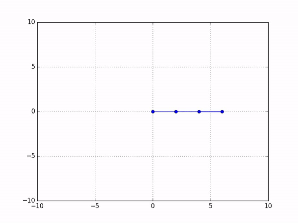
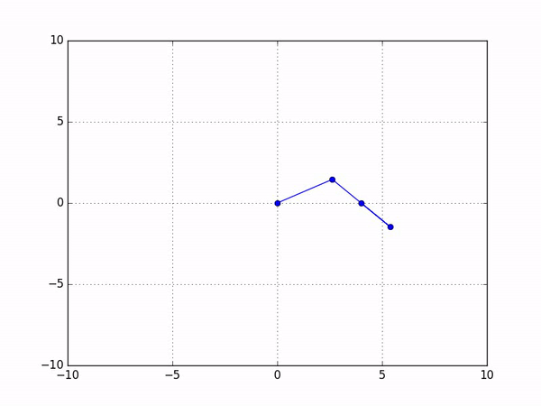
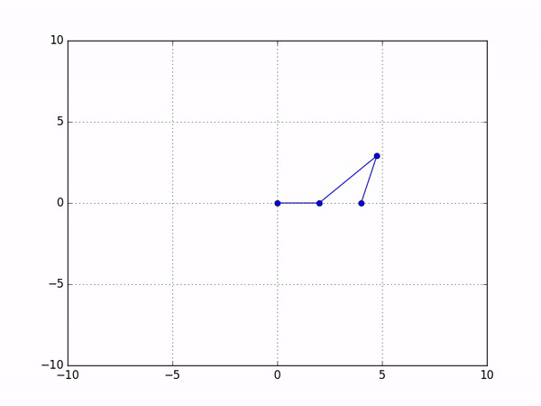

Simulation of 4-bar linkages in Python.

`simulator_based.py` solves the system of equations symbolically.

`newton-based.py` uses an implementation of Newton-Raphson method for multiple variables.

Requires `SymPy`, `NumPy` and `matplotlib`

### Crank-Crank

### Rocker-Crank

### Crank-Rocker

